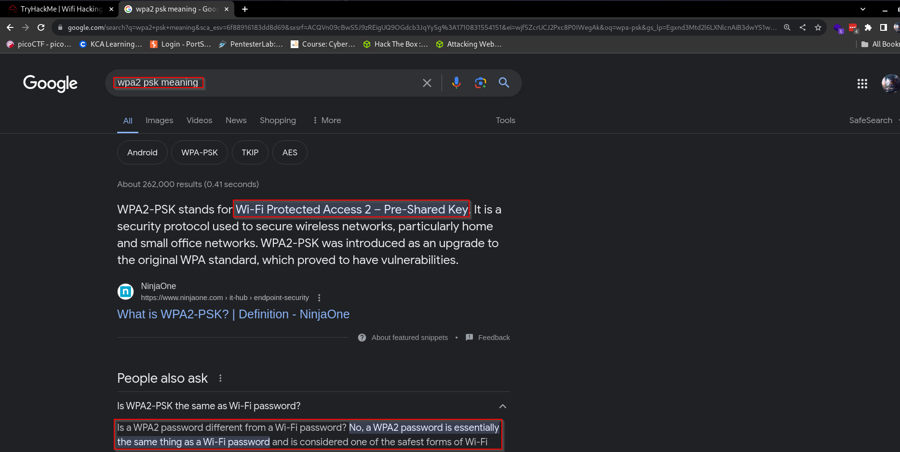

## Introduction
We all use Wi-Fi on a day-to-day basis. There is a lot that happens under the hood of this technology that we are all fond of and rely on every day. This room goes through some of the basics of this technology before we start learning about how to attack such network setups. Let’s dig in. If you wish to follow through, check out the room on TryHackMe called [WIFIHacking101](https://tryhackme.com/room/wifihacking101)

_Disclaimer: The content presented in this article is for educational purposes only and does not endorse or encourage any form of unauthorized access or malicious activity._

### An Intro to WPA
In this section, we go through some of the basics of WIFI technology by going through some terminologies. Some of the discussed terminologies are:
- Wi-Fi Protected Access (WPA) is a security standard for computing devices with wireless internet connections. Very susceptible to brute force attacks.
-	WPA2-PSK: Wifi networks that you connect to by providing a password that's the same for everyone.

Take note that PSK stands for Pre-Shared-Key and is essentially what we commonly refer to as the WIFI password. Its also important to note that it has a minimum number of characters requirement as shown below:

-	WPA2-EAP: Wifi networks that you authenticate to by providing a username and password, which is sent to a RADIUS server.
-	RADIUS: A server for authenticating clients, not just for wifi.
-	SSID: The network "name" that you see when you try and connect.
-	ESSID: An SSID that *may* apply to multiple access points, eg a company office, normally forming a bigger network. For Aircrack they normally refer to the network you're attacking.
-	BSSID: An access point MAC (hardware) address

## Capturing Packets to attack
The most common tools used in WIFI hacking are found in the aircrack-ng suite which comes which consists of tools such as: 
- Aircrack-ng
- Airodump-ng
- Airmon-ng
which mostly attack WPA(2) networks. You also need to ensure you have a monitor mode Network Interface Card (NIC) to capture the 4-way handshake used by WPA networks. If you need results fast, it is good to use injection mode, which de-authenticates a client from the WIFI and forces the handshake to re-occur as the client tries to reconnect to the network.
Most of the commands used to for tools within this suite can be found on [this](https://www.aircrack-ng.org/doku.php?id=airmon-ng)page. We are going to go through some of the basic ones below. But first, here is an overview and summary of things we can do to exploit WPA/WPA2 networks in a flowchart:
